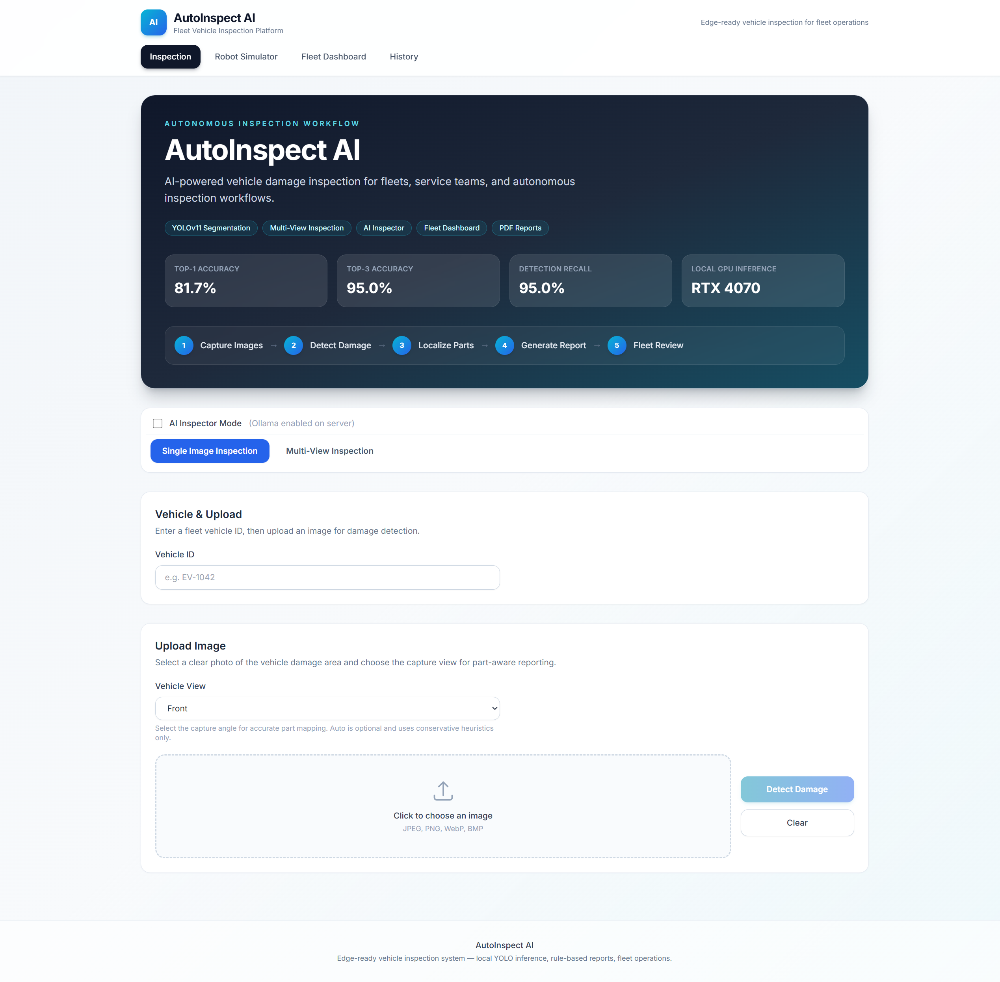
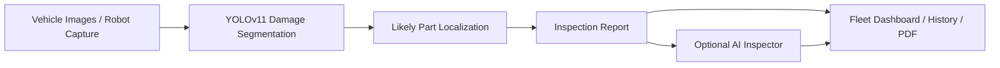
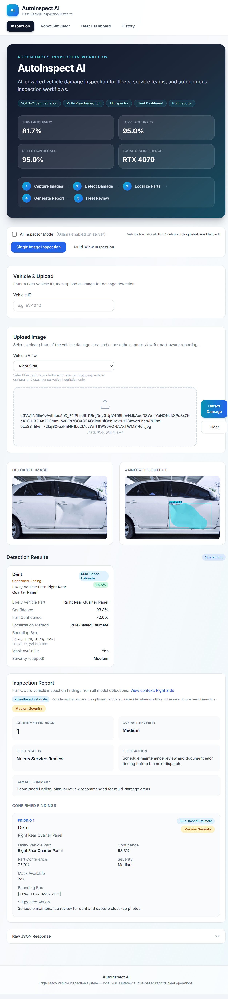
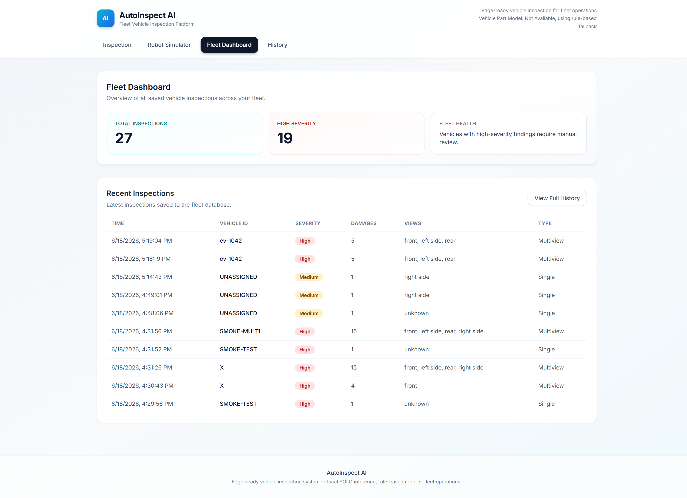

# AutoInspect AI — AI-Powered Vehicle Damage Inspection Platform

**Repository:** [github.com/RamKishoreKV/car-damage-ai](https://github.com/RamKishoreKV/car-damage-ai)

AutoInspect AI is a production-style computer vision platform for fleet vehicle inspection. It uses YOLOv11 segmentation to detect vehicle damage, supports multi-view inspection, generates structured reports, stores inspection history, exports PDFs, and includes an optional local AI inspection assistant.



> Portfolio screenshots live in [`image/`](image/). See [docs/screenshots/README.md](docs/screenshots/README.md) for capture notes.

---

## Feature Highlights

- **YOLOv11 damage segmentation** — local inference with masks and bounding boxes
- **Single-image inspection** — upload, detect, annotate, and report
- **Multi-view inspection** — front, rear, sides, and close-ups combined into one vehicle report
- **Vehicle part localization** — optional part detection model with rule-based fallback (Phase 6)
- **AI Inspector mode** — optional Ollama summaries with rule-based fallback
- **Fleet dashboard** — inspection stats and recent activity
- **Vehicle inspection history** — search by vehicle ID, view full records
- **PDF report export** — downloadable maintenance reports
- **Robot inspection simulator** — autonomous multi-view capture workflow demo
- **Model evaluation pipeline** — structured metrics on CarDD test images

---

## Evaluation Metrics

| Metric | Value |
|--------|-------|
| Top-1 Accuracy | **81.7%** |
| Top-3 Accuracy | **95.0%** |
| Detection Recall | **95.0%** |
| Test set | **60 CarDD images** |
| Inference hardware | **RTX 4070 Laptop GPU** |

**Model:** [harpreetsahota/car-dd-segmentation-yolov11](https://huggingface.co/harpreetsahota/car-dd-segmentation-yolov11)

### Model limitations

The current damage model detects **supported classes only**: dent, scratch, crack, lamp broken, glass shatter, and tire flat. If YOLO returns zero detections, the app shows **No Model-Detected Damage** — this does not guarantee the vehicle is damage-free. Unsupported damage types may require manual review or future model fine-tuning.

```bash
cd backend
venv\Scripts\activate
python download_test_dataset.py
python evaluate_model.py --input test_images --device 0 --confidence 0.25
```

---

## Tech Stack

| Layer | Technologies |
|-------|----------------|
| **Backend** | FastAPI, Python, SQLite, ReportLab |
| **Frontend** | React, Vite, Tailwind CSS |
| **AI / CV** | YOLOv11, PyTorch, OpenCV, Ultralytics |
| **AI Assistant** | Ollama, Qwen2.5 (optional) |
| **Evaluation** | pandas, scikit-learn, matplotlib |

---

## Architecture



---

## Screenshots

| | |
|---|---|
| **Home / Hero** |  |
| **Single inspection** |  |
| **Multi-view report** |  |
| **AI Inspector** |  |
| **Fleet dashboard** |  |
| **History & PDF** |  |
| **Robot simulator** |  |

Capture guide: [docs/screenshots/README.md](docs/screenshots/README.md)

---

## Demo Video

https://drive.google.com/file/d/1jZT-5EL1T-IJwRFTYC2DJS2Jh5UTCJuw/view?usp=drive_link

---

## Local Setup

### Backend

```bash
cd backend
python -m venv venv
venv\Scripts\activate
pip install -r requirements.txt
copy .env.example .env
uvicorn main:app --reload
```

API: **http://localhost:8000**

### Frontend

```bash
cd frontend
npm install
copy .env.example .env
npm run dev
```

UI: **http://localhost:5173**

### Ollama (optional — AI Inspector)

```bash
# Install from https://ollama.com
ollama pull qwen2.5:3b-instruct
```

Set in `backend/.env`:

```env
AI_INSPECTOR_ENABLED=true
OLLAMA_BASE_URL=http://localhost:11434
OLLAMA_MODEL=qwen2.5:3b-instruct
```

---

## Model Weights

**Do not commit large model files.**

- Weights path: `backend/model/best.pt` (~125 MB)
- Auto-downloaded from Hugging Face on first server start or first prediction
- `backend/model/*.pt` is gitignored — each clone downloads or copies weights locally

Manual download:

```bash
cd backend
venv\Scripts\activate
python -c "from huggingface_hub import hf_hub_download; hf_hub_download(repo_id='harpreetsahota/car-dd-segmentation-yolov11', filename='best.pt', local_dir='model', local_dir_use_symlinks=False)"
```

---

## Environment Variables

**Backend** — `backend/.env.example`

```env
API_BASE_URL=http://localhost:8000
AI_INSPECTOR_ENABLED=false
OLLAMA_BASE_URL=http://localhost:11434
OLLAMA_MODEL=qwen2.5:3b-instruct
```

**Frontend** — `frontend/.env.example`

```env
VITE_API_BASE_URL=http://localhost:8000
```

---

## API Overview

| Endpoint | Method | Description |
|----------|--------|-------------|
| `/predict` | POST | Single-image inspection |
| `/predict-multiview` | POST | Multi-view vehicle inspection |
| `/health` | GET | Health check |
| `/fleet/dashboard` | GET | Fleet statistics |
| `/fleet/inspections` | GET | Inspection history |
| `/fleet/inspections/{id}/pdf` | GET | PDF export |

Low-confidence detections (&lt; 40%) are flagged **Potential Finding** with `verification_required: true`.

---

## Project Structure

```
car-damage-ai/
├── backend/           # FastAPI, YOLO inference, fleet DB, PDF
├── frontend/          # React UI
├── image/             # Portfolio screenshots (README embeds)
├── docs/
│   ├── screenshots/   # Optional Playwright capture output
│   ├── demo/          # Demo video & script
│   └── assets/        # Shared media assets
├── DEMO_CHECKLIST.md
├── GITHUB_RELEASE_CHECKLIST.md
└── README.md
```

---

## Features by Phase

| Phase | Capability |
|-------|------------|
| 1 | Single-image inspection |
| 2 | Multi-view combined report |
| 3 | Fleet dashboard, history, PDF |
| 4 | AI Inspector (Ollama + fallback) |
| 5 | Robot inspection simulator |
| 5.5 | Rule-based likely vehicle part localization |
| 6 | Optional vehicle part detection model + overlap matching |

---

## Phase 6 — Vehicle Part Detection Model Integration

AutoInspect AI can run a **second optional YOLO model** for vehicle part detection/segmentation alongside the existing damage model.

### Pipeline

1. **Damage model** (`backend/model/best.pt`) — unchanged YOLOv11 segmentation inference
2. **Part model** (`backend/model/vehicle_parts.pt`) — optional local weights for vehicle parts
3. **Overlap matching** — each damage detection is mapped to the best overlapping part (mask IoU when available, otherwise bbox IoU)
4. **Rule-based fallback** — if the part model is disabled, missing, or overlap is below 10%, existing `part_localizer.py` heuristics are used

### Configuration

```env
USE_VEHICLE_PART_MODEL=true
VEHICLE_PART_MODEL_PATH=backend/model/vehicle_parts.pt
```

Set `USE_VEHICLE_PART_MODEL=false` to always use rule-based localization.

### Model placement

Place your trained part weights at:

```
backend/model/vehicle_parts.pt
```

If `vehicle_parts.pt` is missing, the API logs a warning and continues with rule-based localization — **the app does not crash**.

### Status endpoint

```http
GET /part-model/status
```

Returns whether the feature is enabled, whether weights are available, model path, and supported part classes.

### Detection fields

Each detection may include:

| Field | Description |
|-------|-------------|
| `vehicle_part` | Human-readable part label |
| `part_confidence` | Part model confidence or rule-based score |
| `localization_method` | `part_model_overlap` or `rule_based_bbox` |
| `part_bbox` | Part bounding box when matched by part model |

---

## Roadmap

- **Cloud deployment** — hosted multi-tenant SaaS
- **Jetson edge deployment** — on-vehicle GPU inference
- **Real robot camera integration** — live capture metadata from inspection robots
- **Production authentication and user management** — roles, orgs, API keys

---

## Portfolio Resources

- [GitHub release checklist](GITHUB_RELEASE_CHECKLIST.md)
- [Resume bullets](docs/RESUME_BULLETS.md)
- [Demo script](docs/demo/DEMO_SCRIPT.md)

---

## License

Model weights are subject to the license on the [Hugging Face model card](https://huggingface.co/harpreetsahota/car-dd-segmentation-yolov11).
